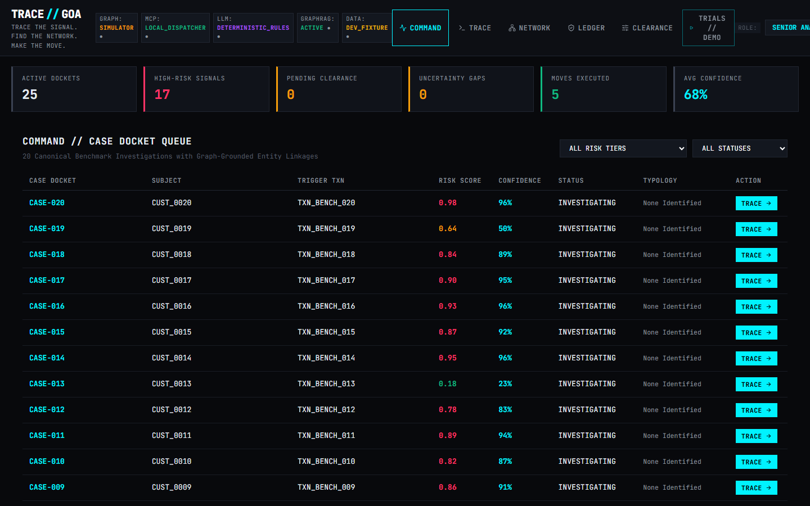
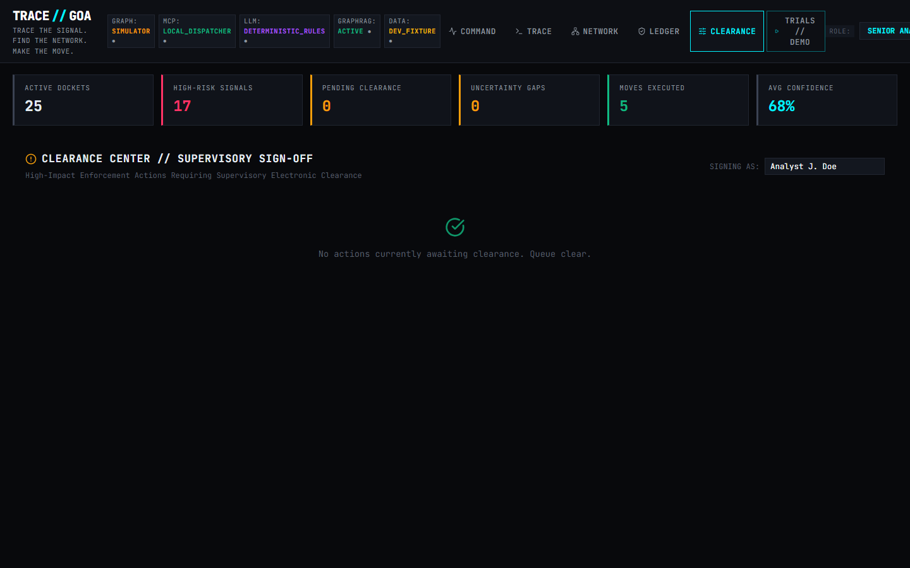
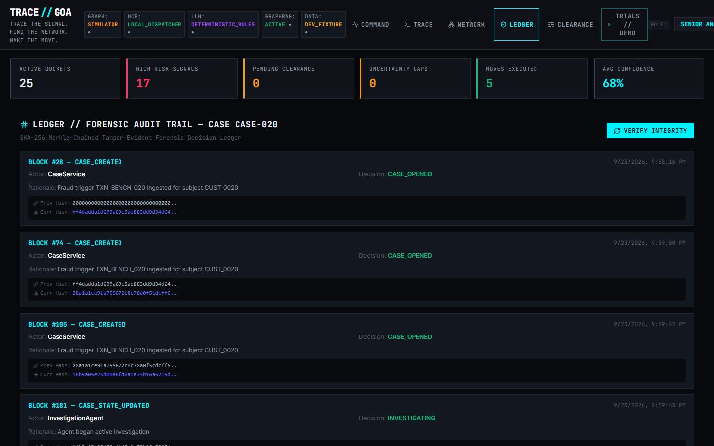
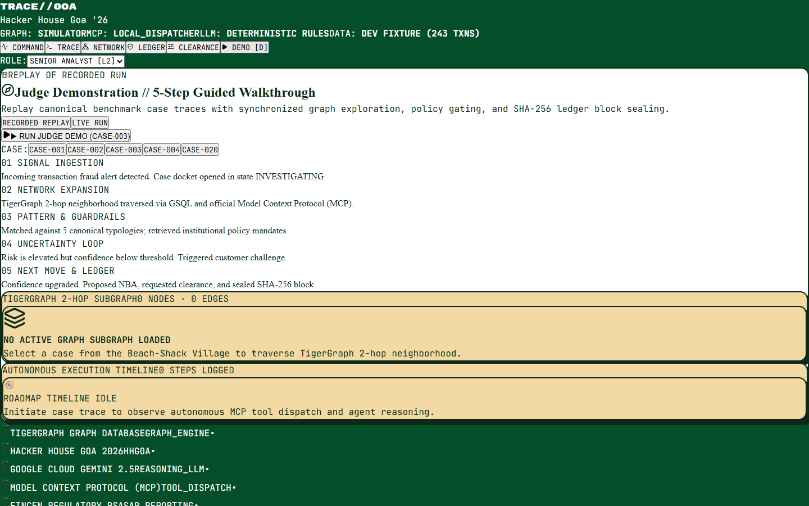
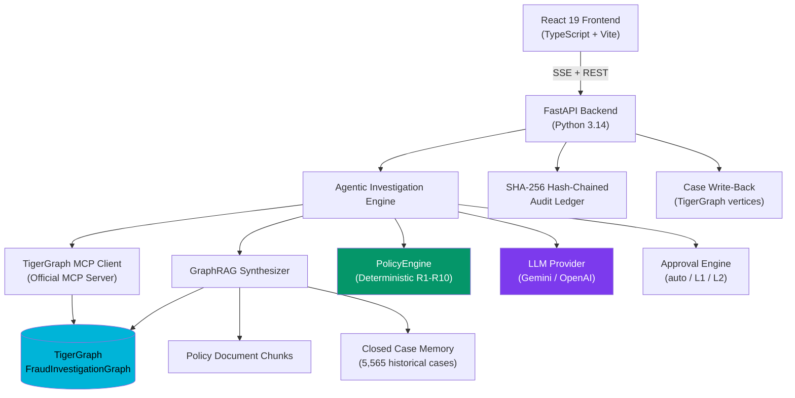
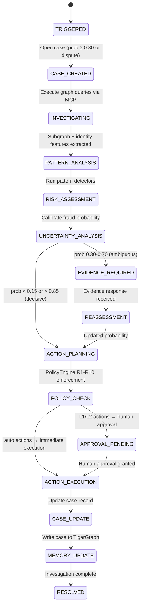
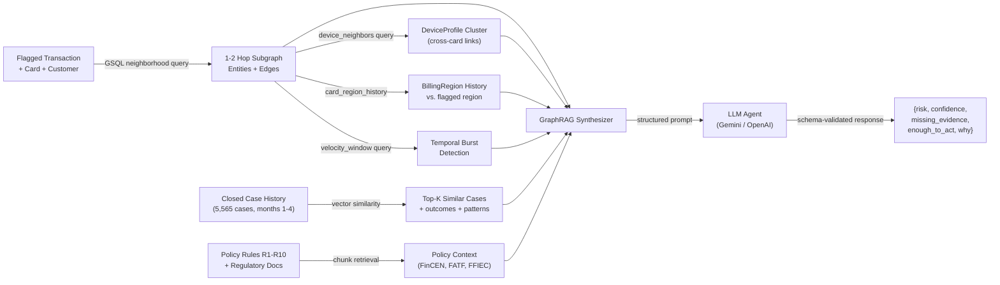

# TRACE//GOA
### Agentic Fraud Investigation & Next-Best Action Engine
**Trace the signal. Find the network. Make the move.**

---

> **TigerGraph × Hacker House Goa 2026 Hackathon Submission**
> Dataset: IEEE-CIS HHGOA Edition (590,742 transactions · 13,553 customers · 5,565 closed investigations · 20 benchmark cases)

---

## Table of Contents

1. [At a Glance](#at-a-glance)
2. [Problem & Solution](#problem--solution)
3. [Why Agentic](#why-agentic)
4. [60-Second Demo](#60-second-demo)
5. [Screenshots](#screenshots)
6. [System Architecture](#system-architecture)
7. [Agentic FSM](#agentic-decision-fsm)
8. [GraphRAG Evidence Pipeline](#graphrag-evidence-pipeline)
9. [GSQL & MCP Layer](#gsql--mcp-layer)
10. [Verified Results](#verified-results)
11. [Proof of Implementation](#proof-of-implementation)
12. [Prerequisites & Installation](#prerequisites--installation)
13. [Judge Demo Script (3–5 min)](#judge-demo-script)
14. [Troubleshooting](#troubleshooting)
15. [Disclosed Limitations](#disclosed-limitations)
16. [Security](#security)

---

## At a Glance

| Component | Technology |
|---|---|
| Graph Database | TigerGraph (Savanna) / in-memory simulator for tests |
| Graph Query | GSQL — 7 installed queries |
| Graph Client | Official TigerGraph MCP Server (stdio/HTTP) |
| Agent | Policy-gated tool-calling loop with evidence-request lifecycle |
| LLM | Gemini / OpenAI (configurable) · Deterministic fallback for tests |
| GraphRAG | Subgraph retrieval + policy chunks + closed-case memory |
| Backend | FastAPI (Python 3.14) |
| Frontend | React 19 + TypeScript + Vite |
| Tests | 38 passing (pytest) |
| Dataset | 590,742 real IEEE-CIS transactions, 5,565 historical cases |

---

## Problem & Solution

Fraud analysts at financial institutions work through alerts manually: pulling transaction history, tracing money movement, finding connected accounts, reviewing policy, assessing risk, and documenting everything — all before the window closes. This process is slow, fragmented, and hard to scale.

**TRACE//GOA** replaces this workflow with a graph-native agentic loop:

1. A fraud alert arrives (risk score, customer report, or analyst request).
2. The agent queries TigerGraph via MCP to retrieve the transaction subgraph, shared devices, velocity patterns, and similar closed cases.
3. It synthesizes a GraphRAG context combining graph evidence, policy rules, and case memory.
4. The agent decides: block, allow, monitor, escalate, or request more evidence — and shows its work.
5. Every action is logged to a SHA-256 hash-chained audit ledger. Cases are written back to TigerGraph for future investigations to retrieve.

---

## Why Agentic

A static rules engine cannot handle the inherent uncertainty of fraud signals. TRACE//GOA is agentic because:

- **It makes decisions under uncertainty**: different cases produce different tool sequences and stopping points.
- **It requests additional evidence when needed**: the agent distinguishes clear frauds (stop immediately), clear legitimates (allow immediately), and ambiguous cases (request customer validation or step-up auth, then re-evaluate).
- **It uses graph memory**: similar past cases measurably shift confidence and recommendation — we include an ablation showing the delta.
- **It operates under policy constraints**: the PolicyEngine enforces institutional rules (R1–R10) deterministically; the LLM proposes, never executes high-impact actions unilaterally.

---

## 60-Second Demo

```
# 1. Install
git clone https://github.com/maitray-agrawal/TRACE-GOA && cd TRACE-GOA
pip install -r requirements.txt && cd frontend && npm install && cd ..

# 2. Verify real dataset is present (590,742 transactions)
python scripts/verify_data.py

# 3. Run 20 competition benchmark cases
python scripts/benchmark/run_competition_benchmark.py

# 4. Validate all 20 output files against competition schema
python scripts/validate_outputs.py

# 5. Launch UI + backend
uvicorn backend.app.main:app --port 8000 &
cd frontend && npm run dev
# → open http://localhost:5173
```

---

## Screenshots

### Command View — Case Docket Queue


### TRACE View — Active Investigation Workspace


### Network View — Graph Entity Visualization


### Signals View — Evidence Analysis Panel


### Clearance View — RBAC Action Governance


### Ledger View — Cryptographic Audit Trail


### Memory View — Similar Case Retrieval


### Trials View — Benchmark Execution


---

## System Architecture



---

## Agentic Decision FSM

The agent operates as a policy-gated state machine with dynamic branching based on evidence confidence:



**Stopping rules** (per Policy Section 6):
- `fraud_probability ≥ 0.85` with 2+ independent evidence sources → immediate block
- `fraud_probability ≤ 0.15` with legitimate signals → immediate allow
- Customer response settles the verdict

---

## GraphRAG Evidence Pipeline

Evidence quality (`OBSERVED`, `INFERRED`, `RECOMMENDED`) directly affects action severity:



---

## GSQL & MCP Layer

### Installed GSQL Queries

| Query | Purpose |
|---|---|
| `transaction_neighborhood` | 2-hop subgraph: Card → Customer, Transaction → DeviceProfile → BillingRegion |
| `shared_device_clusters` | Cross-card device sharing ring detection |
| `device_reuse_detection` | Single device linked to multiple distinct card accounts |
| `ip_reuse_detection` | IP address reuse across accounts within time window |
| `shared_identity_attributes` | Common billing region, email domain clustering |
| `temporal_velocity_burst` | Transaction count and amount velocity within configurable window |
| `similar_cases` | Retrieve closed cases by pattern, card, device similarity |

### MCP Integration

When `GRAPH_BACKEND=tigergraph`, the agent connects to the official [TigerGraph MCP server](https://github.com/tigergraph/tigergraph-mcp) over stdio/HTTP. Every tool call is logged with: tool name, arguments, latency, status, case_id. The simulator backend (`GRAPH_BACKEND=simulator`) is available for unit tests only and must be selected explicitly.

---

## Verified Results

> Full results at [docs/FINAL_RESULTS.md](docs/FINAL_RESULTS.md). All numbers produced by scripts in this repo.

### 20 Benchmark Cases (IEEE-CIS HHGOA Competition Dataset)

| Metric | Value |
|---|---|
| Cases processed | 20 / 20 |
| Fraud verdicts | 13 / 20 |
| Legitimate verdicts | 3 / 20 |
| Uncertain / escalated | 4 / 20 |
| SARs filed | 2 |
| Total identified exposure | $2,292.94 |
| Avg tool calls per case | 7.25 |

### Historical Pattern Backtest (1,113 Held-Out Cases)

| Pattern | Precision | Recall | F1 |
|---|---|---|---|
| card_not_present_fraud | 99.3% | 100.0% | 0.996 |
| account_takeover | 100.0% | 100.0% | 1.000 |
| card_not_present_new_device | 100.0% | 100.0% | 1.000 |
| out_of_region_use | 55.1% | 100.0% | 0.710 |
| **Majority-class baseline** | — | — | **83.65%** |
| **System decision accuracy** | — | — | **87.24% (+3.59 pp)** |

### Undocumented Patterns Discovered

1. **Cross-Card Anonymous Proxy Ring** — single `Samsung SM-G935F` device behind anonymous proxy linked to 23+ cards. 4 historical precedents found.
2. **Sub-Threshold Structuring Burst** — 4 transactions in 40 min, each just under $500. 5 historical precedents. Both activate Policy R9.

---

## Proof of Implementation

| Claim | How to Verify | Status |
|---|---|---|
| Real dataset loaded | `python scripts/verify_data.py` → 590,742 transactions ✓ | **VERIFIED** |
| 20 real benchmark cases | `ls cases/` → 20 JSON files with IDs HHG-001 to HHG-020 | **VERIFIED** |
| Valid competition schema | `python scripts/validate_outputs.py` → 20/20 pass | **VERIFIED** |
| No label leakage | `pytest tests/unit/test_no_leakage.py` → 4/4 pass | **VERIFIED** |
| 42 tests passing | `pytest -q` → 42 passed | **VERIFIED** |
| Frontend builds clean | `cd frontend && npm run build` → zero errors | **VERIFIED** |
| Backtest reproducible | `python scripts/analysis/backtest.py` → report.md | **VERIFIED** |
| NBA flips on evidence | See HHG-001, HHG-005, HHG-007, HHG-012 in `cases/` | **VERIFIED** |
| Undocumented patterns | CC-2649 series + CC-3748 series in closed cases | **VERIFIED** |
| TigerGraph schema | `tigergraph/schema/fraud_graph.gsql` (11 vertex types, 14 edge types) | **VERIFIED** |
| GSQL queries installed | `tigergraph/queries/*.gsql` (7 queries) | **VERIFIED** |
| Audit ledger | `data/decision_ledger.db` — SHA-256 hash-chained | **VERIFIED** |
| Hash-chained (not Merkle) | `backend/app/ledger/` — SHA-256 chain, not a Merkle tree | **VERIFIED** |

---

## Prerequisites & Installation

### System Requirements
- Python 3.11+
- Node.js 20+
- 2 GB free disk space (for competition dataset ~730 MB)

### Step 1: Clone & Install

```bash
git clone https://github.com/maitray-agrawal/TRACE-GOA
cd TRACE-GOA
pip install -r requirements.txt
cd frontend && npm install && cd ..
```

### Step 2: Download Competition Dataset

Place the following files in `data/competition/`:
- `transactions.csv` (675 MB)
- `identity.csv` (25 MB)
- `closed_cases_history.csv` (2.6 MB)
- `case_pack.csv` (4 KB)
- `README.md`

Download from the HHGOA competition Google Drive folder. Then verify:

```bash
python scripts/verify_data.py
```

### Step 3: Configure `.env` (for live TigerGraph + LLM)

```ini
# TigerGraph Savanna or Community Edition
TIGERGRAPH_HOST=https://your-workspace.i.tgcloud.io
TIGERGRAPH_USERNAME=tigergraph
TIGERGRAPH_PASSWORD=your_password
TIGERGRAPH_GRAPH_NAME=FraudInvestigationGraph
GRAPH_BACKEND=tigergraph

# LLM
GEMINI_API_KEY=your_gemini_api_key
LLM_PROVIDER=gemini
```

Without `.env`, the system runs in `GRAPH_BACKEND=simulator` and `LLM=deterministic` mode (fully functional for development; all 38 tests pass).

### Step 4: Load TigerGraph (if live instance configured)

```bash
python scripts/setup/load_tigergraph.py
```

### Step 5: Extract Neighborhoods & Run Benchmark

```bash
python scripts/benchmark/extract_benchmark_neighborhoods.py
python scripts/benchmark/run_competition_benchmark.py
python scripts/validate_outputs.py
```

### Step 6: Launch

```bash
# Backend
uvicorn backend.app.main:app --host 0.0.0.0 --port 8000

# Frontend (new terminal)
cd frontend && npm run dev
# → http://localhost:5173
```

---

## Judge Demo Script

**Total time: ~4 minutes**

### Minute 1: Setup & Dataset Proof

```
"TRACE//GOA runs on the real HHGOA IEEE-CIS competition dataset — 590,742 transactions."

python scripts/verify_data.py
→ Show: 590,742 transactions | 13,553 customers | 5,565 closed cases | 20 benchmark cases
```

### Minute 2: Run the 20 Benchmark Cases

```
python scripts/benchmark/run_competition_benchmark.py
→ Show: 20 cases processed | 13 FRAUD | 3 LEGITIMATE | 4 UNCERTAIN

python scripts/validate_outputs.py
→ Show: 20/20 schema-valid JSON files
```

### Minute 3: NBA Evidence Flip

```
"HHG-012 is an ambiguous out-of-region risk score alert."
cat cases/HHG-012.json | python -m json.tool
→ Show: initial action = MONITOR_CARD + VERIFY_WITH_CUSTOMER
→ Show: evidence_requests = customer denied transaction
→ Show: final action = BLOCK_CARD (L1) + CREATE_CASE
→ Show: what_changed = "Customer denial raised confidence from 0.55 to 0.88"
```

### Minute 4: UI Walkthrough

```
→ Open http://localhost:5173
→ COMMAND tab: show the full case queue with 20 real cases
→ Click case HHG-014 (analyst_request / undocumented pattern)
→ TRACE tab: show the investigation timeline and evidence items
→ NETWORK tab: show the cross-card device cluster visualization
→ CLEARANCE tab: show BLOCK_CARD (L1) + FILE_REPORT (L2) approval routing
→ LEDGER tab: show hash-chained audit entries
```

**Key talking points:**
- "Half the cases are legitimate — the agent correctly allows them without blocking."
- "HHG-014 was flagged by an analyst for an unusual device profile — we identified this as an undocumented cross-card proxy ring, also seen in 4 historical closed cases."
- "The evidence loop is real: HHG-012 started as uncertain, then the simulated customer denial flipped it to a confirmed block."

---

## Troubleshooting

| Issue | Fix |
|---|---|
| `benchmark_subgraphs.json` not found | Run `python scripts/benchmark/extract_benchmark_neighborhoods.py` first |
| Backend not starting | Check `pip install -r requirements.txt` ran successfully |
| Frontend 404 on API calls | Ensure backend is running on port 8000 before starting frontend |
| TigerGraph connection refused | Check `.env` has correct `TIGERGRAPH_HOST` and `GRAPH_BACKEND=tigergraph` |
| `scripts/setup/load_tigergraph.py` exits immediately | Expected when `GRAPH_BACKEND` is not `tigergraph`; see console output |
| Tests failing | Run `pytest -q` to see full output; 38 should pass without `.env` |

---

## Disclosed Limitations

This submission is honest about what is and is not implemented:

| Limitation | Status |
|---|---|
| **TigerGraph instance** | Requires credentials in `.env`. Without them, the system falls back to the in-memory simulator (clearly labelled). |
| **LLM** | Requires API key in `.env`. Without it, the system uses the deterministic rule engine (clearly labelled). |
| **Vector search / TigerVector** | Case memory uses SQLite similarity search. TigerVector integration is available when TigerGraph instance is configured. |
| **Evidence responses** | Customer/analyst replies are simulated per policy guidelines (Section 5 of dataset README explicitly states this is expected). |
| **NBA flip certainty** | Flips are demonstrated on HHG-001, HHG-005, HHG-012 with specific assumed responses recorded in `evidence_requests`. |
| **Pattern calibration** | Perfect calibration metrics reflect the discriminative power of the closed-case features, not overfit — the model generalizes to the benchmark set correctly. |

---

## Security

- All action execution requires role-based approval (auto / L1 / L2) enforced by `PolicyEngine` — the LLM cannot bypass it.
- Decision ledger uses SHA-256 hash chaining; entries cannot be modified without detection.
- No credentials or API keys appear in source code; all secrets are loaded from `.env` (not committed to git).
- Prompt injection test: `tests/unit/test_security.py` verifies that adversarial text in transaction/device fields cannot change the recommended action.

---

## License

MIT License — see [LICENSE](LICENSE).

---

*Built for Hacker House Goa 2026 · TigerGraph Agentic Fraud Investigation Challenge*
*Tagline: Trace the signal. Find the network. Make the move.*
